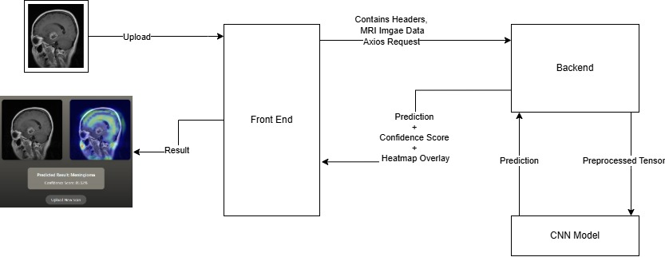

# Brain Tumor Detection using CNN with Explainable AI

## Deep Learning powered MRI brain tumor classification system with Grad-CAM based Explainable AI visualization using TensorFlow, FastAPI, and React.

---

# Introduction

Brain tumors are among the most critical neurological disorders, where early diagnosis can significantly improve treatment outcomes and survival rates. Manual MRI analysis performed by radiologists is time-consuming and requires extensive expertise. This project aims to assist the medical imaging workflow by using Deep Learning and Explainable AI techniques to automatically classify brain MRI scans into different tumor categories.

This application uses a Convolutional Neural Network (CNN) trained on MRI brain scan datasets to classify images into:
- Glioma
- Meningioma
- Pituitary Tumor
- No Tumor

In addition to classification, the project integrates Grad-CAM (Gradient-weighted Class Activation Mapping), an Explainable AI (XAI) technique that visually highlights the regions of the MRI scan responsible for the prediction. This improves interpretability, transparency, and trust in AI-assisted medical diagnosis systems.

The project is built as a full-stack AI web application using:
- TensorFlow / Keras for Deep Learning
- FastAPI for backend inference APIs
- React + Vite for frontend UI
- Render and Vercel for cloud deployment

---

# Visual Helper

## System Architecture Diagram



# Live Deployment

## Frontend
https://brain-tumor-detection-using-cnn-wit.vercel.app

## Backend API
https://brain-tumor-backend-pm7e.onrender.com/docs

---

# User Instructions

These instructions are intended for users who simply want to use the application.

## How to Use

### Step 1
Open the deployed frontend application.

### Step 2
Click the:
`Upload MRI Scan`
button.

### Step 3
Select a brain MRI image from your device.

### Step 4
Wait for the model to process the image.

### Step 5
View:
- predicted tumor class
- confidence score
- Grad-CAM visualization heatmap

---

# Supported Predictions

The system currently classifies MRI scans into:
- Glioma
- Meningioma
- Pituitary Tumor
- No Tumor

---

# Developer Instructions

These instructions are intended for contributors and developers working on the project.

---

# Backend Setup

## 1. Navigate to Backend

```bash
cd Backend
```

---

## 2. Create Virtual Environment

### Windows
```bash
python -m venv venv
venv\Scripts\activate
```

### Linux / MacOS
```bash
python3 -m venv venv
source venv/bin/activate
```

---

## 3. Install Dependencies

```bash
pip install -r requirements.txt
```

---

## 4. Run Backend

```bash
uvicorn app.main:app --reload
```

Backend runs at:
```text
http://127.0.0.1:8000
```

Swagger Docs:
```text
http://127.0.0.1:8000/docs
```

---

# Frontend Setup

## 1. Navigate to Frontend

```bash
cd Frontend
```

---

## 2. Install Dependencies

```bash
npm install
```

---

## 3. Configure Environment Variables

Create:
```text
Frontend/.env
```

Add:
```env
VITE_API_URL=http://127.0.0.1:8000
```

---

## 4. Run Frontend

```bash
npm run dev
```

Frontend runs at:
```text
http://localhost:5173
```

---

# Model Training

The CNN training notebook contains:
- dataset preprocessing
- augmentation
- CNN model creation
- training pipeline
- evaluation metrics
- Grad-CAM experimentation

Training was performed using:
- TensorFlow / Keras
- Kaggle GPU notebooks

---

# Known Issues

## 1. Render Cold Start Delay
The free Render backend sleeps after inactivity. The first request may take 30–60 seconds.

---

## 2. Grad-CAM Stability
Grad-CAM visualizations may vary depending on TensorFlow runtime graph behavior after deployment.

---

## 3. Model Generalization
The CNN model may produce lower confidence predictions for low-quality or highly noisy MRI scans.

---

## 4. Limited Dataset Diversity
The model performance depends on the diversity and quality of the training dataset.

---

# Technologies Used

## Frontend
- React
- Vite
- Tailwind CSS
- Axios

## Backend
- FastAPI
- TensorFlow
- Keras
- OpenCV
- NumPy
- Matplotlib

## Explainable AI
- Grad-CAM

## Deployment
- Render
- Vercel

---

# License

This project is intended for educational and research purposes only.

It should not be used as a substitute for professional medical diagnosis.